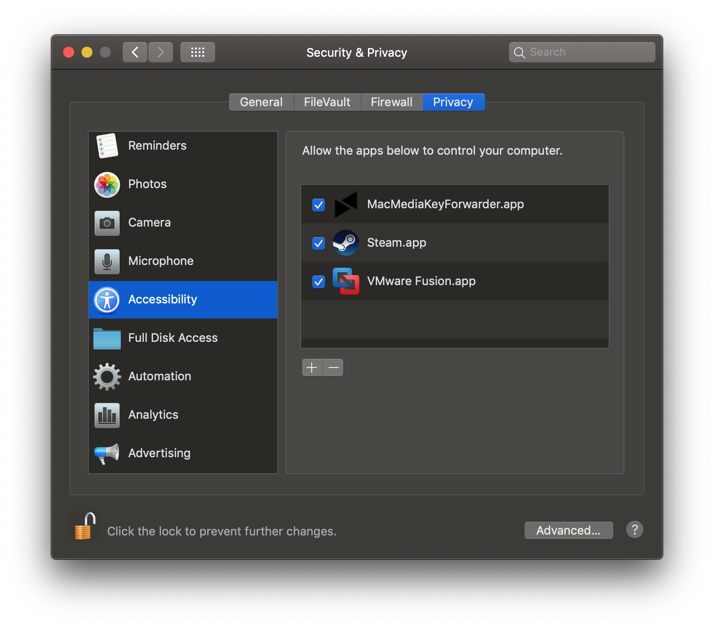
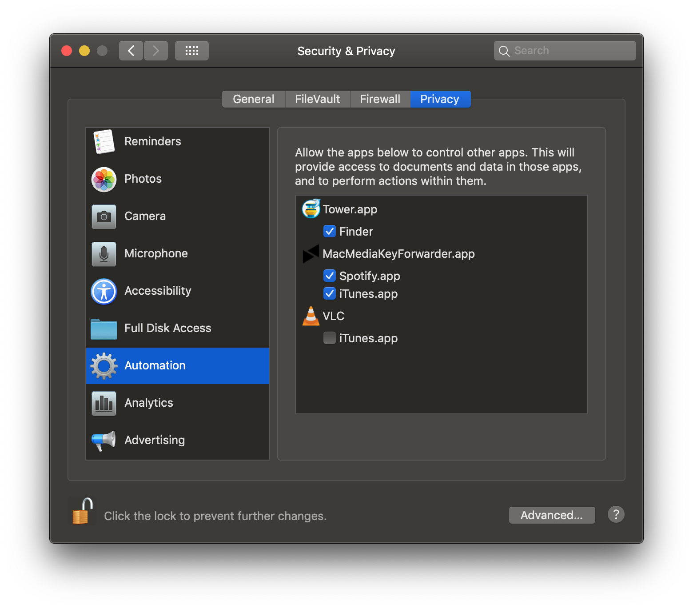

# Mac Media Key Forwarder 

( Formerly known as High Sierra Media Key Enabler )

Mac Media Key Forwarder for [iTunes](https://www.apple.com/itunes/) and [Spotify](http://www.spotify.com).

---

Forwards media keys to iTunes or Spotify directly.

You can prioritize which app you would like to control or you can go with the default behaviour which controls the running app.

The app runs in the menu bar.

Download the compiled application from my [homepage](http://milgra.com/mac-media-key-forwarder.html).

If you want even more control over what you want to control you should try [beardedspice](http://beardedspice.github.io).

**Issues you should know about**

The app listens on the event tap for key events. This causes problems in some rare cases, like 
- when changing search engine in Safari's preferences window
- when trying to allow third-party kernel extensions

In these cases simply pause Mac Media Key Forwarder from it's menu.

**Installation & MacOS Mojave Compatibility**

The app itself is compatible with Mojave, but you need to add it as trusted application in order to make it function properly.

You can do this with these steps:
1. Go to **System Preferences** > **Security & Privacy**
2. Open the **Privacy** tab, and look for **Accessibility** in the left list
3. Turn on the checkbox for **MacMediaKeyForwarder.app** in the right list
2. Look for **Automation** in the left list
3. Turn on the checkbox for **iTunes.app** and **Spotifiy.app** under **MacMediaKeyForwarder.app** in the right list
4. Run the app again

**Other milgra utilities you might be interested in**

[mac audio keepalive](https://github.com/milgra/macaudiokeepalive)

[airpods sound quality fixer](https://github.com/milgra/airpodssoundqualityfixer)

[fat fingers keyboard for iphone](https://github.com/milgra/fatfingerskeyboard)

---

**Contributors :** 
* Michael Dorner ([@michaeldorner](http://github.com/michaeldorner))
* Matt Chaput ([@mchaput](http://github.com/mchaput))
* Ben Kropf ([@ben-kropf](http://github.com/ben-kropf))
* Alejandro Iván ([@alejandroivan](http://github.com/alejandroivan))
* Sungho Lee ([@sh1217sh](http://github.com/sh1217sh))
* Björn Büschke ([@maciboy](http://github.com/maciboy))
* Sergei Solovev ([@e1ectron](http://github.com/e1ectron))
* Munkácsi Márk ([@munkacsimark](http://github.com/munkacsimark))
* Irvin Lim ([@irvinlim](https://github.com/irvinlim))
* Simon Seku ([@SimonSeku](https://github.com/SimonSeku))
* Dave Nicolson ([@dnicolson](https://github.com/dnicolson))
* teemue ([@teemue](https://github.com/teemue))
* takamu ([@takamu](https://github.com/takamu))
* Alex ([@sashoism](https://github.com/sashoism))
* Sebastiaan Pasma ([@spasma](https://github.com/spasma))
* WiktorBuczko ([@WiktorBuczko](https://github.com/WiktorBuczko))
* Andy White ([@arcwhite](https://github.com/arcwhite))
* xjbeta ([@xjbeta](https://github.com/xjbeta))

Thank you!!!

---

*What's new in version 3.0 :*
- Catalina compatibility

*What's new in version 2.8 :*
- Polish localization
- Fixed broken Japanese, Finnish, Dutch localization 

*What's new in version 2.7 :*
- Dutch localization 

*What's new in version 2.6 :*
- Enabled undocking status bar item 

*What's new in version 2.5 :*
- Finnish, Japanese localization
- Modified Accessibility Instructions

*What's new in version 2.3 :*
- Korean, Danish, Russian and Hungarian localization is linked back to the project ( they got lost somewhere :( )

*What's new in version 2.2 :*
- MacOS Mojave 10.14.2 fix, showing notification pop-up if tap cannot be created

*What's new in version 2.1 :*
- app brings up permission popups if permission is not granted for Accessibility and Automation Target

What's new in version 2.0 :
- app renamed to Mac Media Key Forwarder
- Hungarian localization
- updated icon
- Open At Login state is checked every time the menu is opened so it shows an updated state
- added installation steps to readme because increased MacOS security made it more confusing
- added event-tap related issues to readme because it can cause head scratches in some special cases 

What's new in version 1.9 :
- added open at login menu option
- German localization update
- Korean localization update

What's new in version 1.8 :
- added pause menu option
- added pause automatically menu option : if no music player is running macOS default behavior is used and keys are forwarded to currently active media player
- Russian localization
- German localization
- Spanish localization
- fixed headphone button issue
- added macOS Sierra compatibility if you want explicit music player control there

What's new in version 1.7 :
- fast forward/rewind is possible when iTunes is selected explicitly
- Korean localization
- rumors say that it works with TouchBar

What's new in version 1.6 :
- increased compatibility with external keyboards

What's new in version 1.5 :
- now you can explicitly prioritize iTunes or Spotify
- play button now starts up iTunes or Spotify if they are not running aaaand explicitly selected

What's new in version 1.4 :
- memory leak fixed

What's new in version 1.3 :
- previousTrack replaced with backTrack in case of iTunes for a better experience

What's new in version 1.2 :
- new icon
- source code is super tight now
- developer id signed, its a trusted app now

---
